# KVM快照管理

2054305 陈敬麒

## 需求分析->功能实现

1. 创建快照：详见快照-拍摄快照
2. 导出快照：详见虚拟机管理-导出快照
3. 导入快照，生成虚拟机：详见虚拟机管理-导入虚拟机
4. 移除快照：详见快照管理-移除快照

## 功能说明

**【使用说明】**

1. 进入kvm_manage目录 cd kvm_manage

2. 给脚本分配读写执行权限 chmod 755 kvm_manage.sh

3. 执行shell脚本   ./kvm_manage.sh 即可

4. 导入导出等功能的实现需要sudo user权限

   ```shell
   ~$ cd kvm_manage
   ~/kvm_manage$ chmod 755 kvm_manage.sh
   ~/kvm_manage$ ./kvm_manage.sh
   
   ```

   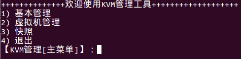

### 基础管理

```shell
【KVM管理[主菜单]】：1 
1) 查看所有KVM	  3) 开机	    5) 重启	      7) 删除KVM
2) 正在运行的KVM  4) 关机	    6) 强制关机	      8) 返回上一级
```

#### 查看所有KVM

```
【KVM管理[主菜单]】：1
1) 查看所有KVM	  3) 开机	    5) 重启	      7) 删除KVM
2) 正在运行的KVM  4) 关机	    6) 强制关机	      8) 返回上一级
[基本管理]：1
 Id    名称                         状态
----------------------------------------------------
 -     test                           关闭
 -     vm1                            关闭

```

#### 查看正在运行的KVM

```
[基本管理]：
1) 查看所有KVM	  3) 开机	    5) 重启	      7) 删除KVM
2) 正在运行的KVM  4) 关机	    6) 强制关机	      8) 返回上一级
[基本管理]：2
 Id    名称                         状态
----------------------------------------------------
 3     vm1                            running

```

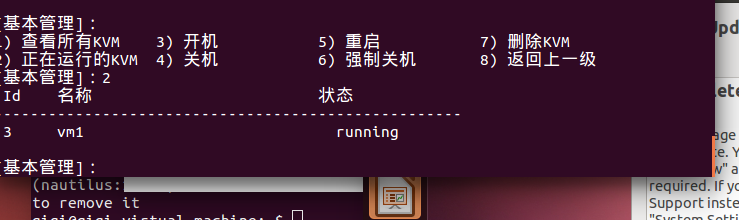

#### 开机

```
[基本管理]：3
当前拥有的KVM：test vm1
请输入您要开启的KVM：vm1
域 vm1 已开始
```

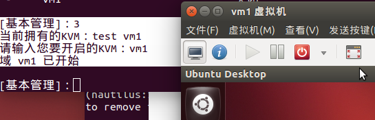

#### 关机

```
[基本管理]：
1) 查看所有KVM	  3) 开机	    5) 重启	      7) 删除KVM
2) 正在运行的KVM  4) 关机	    6) 强制关机	      8) 返回上一级
[基本管理]：4
当前正在运行的KVM：vm1
请输入您要关闭的KVM：vm1
域 vm1 被关闭

```

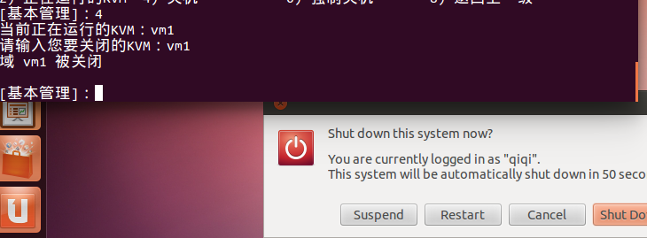

#### 重启

```
[基本管理]：
1) 查看所有KVM	  3) 开机	    5) 重启	      7) 删除KVM
2) 正在运行的KVM  4) 关机	    6) 强制关机	      8) 返回上一级
[基本管理]：5
当前正在运行的KVM：vm1
请输入您要重启的KVM：vm1
域 vm1 正在被重新启动
```

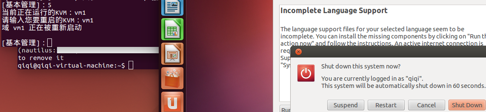

#### 强制关机

```
[基本管理]：
1) 查看所有KVM	  3) 开机	    5) 重启	      7) 删除KVM
2) 正在运行的KVM  4) 关机	    6) 强制关机	      8) 返回上一级
[基本管理]：6
当前正在运行的KVM：vm1
请输入您要强制关闭的KVM：vm1
域 vm1 被删除

```

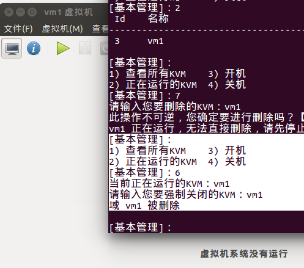

#### 删除KVM

(若开机状态无法删除

```
[基本管理]：
1) 查看所有KVM	  3) 开机	    5) 重启	      7) 删除KVM
2) 正在运行的KVM  4) 关机	    6) 强制关机	      8) 返回上一级
[基本管理]：7
请输入您要删除的KVM：vm1
此操作不可逆，您确定要进行删除吗？【Y/N】y
vm1 正在运行，无法直接删除，请先停止机器。
```

（强制关机后

```
【KVM管理[主菜单]】：1
1) 查看所有KVM	  3) 开机	    5) 重启	      7) 删除KVM
2) 正在运行的KVM  4) 关机	    6) 强制关机	      8) 返回上一级
[基本管理]：7
请输入您要删除的KVM：vm1
此操作不可逆，您确定要进行删除吗？【Y/N】y
已为您删除vm1，您要删除vm1的磁盘文件吗？【Y/N】y
已为您删除磁盘文件。
```

## 虚拟机管理

```shell
【KVM管理[主菜单]】：2
1) 通过配置文件获取信息	3) 导入虚拟机		  5) 查看真机硬件信息
2) 导出虚拟机		   4) 查看KVM硬件信息	    6) 返回上一级
```

#### 通过配置文件获取信息

```
【KVM管理[主菜单]】：2
1) 通过配置文件获取信息	 3) 导入虚拟机		  5) 查看真机硬件信息
2) 导出虚拟机		 4) 查看KVM硬件信息	  6) 返回上一级
[虚拟机管理]：1
【提示：需要用sudo语句执行】
请输入机器名：vm1
请输入配置文件名 [vm1.xml]
请输入配置文件所在目录 [/etc/libvirt/qemu/]
-------------------虚拟机配置信息如下------------------------
	虚拟机名          ：vm1
	虚拟机配置文件    ：/etc/libvirt/qemu//vm1.xml
	虚拟机映像名      ：vm1.qcow2
	虚拟机映像绝对路径：/var/lib/libvirt/images/vm1.qcow2
------------------------------------------------------------
```

#### 导出虚拟机

*通过配置文件，导出虚拟机*

【提供了默认的配置文件地址 /etc/libvirt/qemu/${vm_name}.xml，也可以自行输入

【提供了默认的快照文件地址 /var/lib/libvirt/qemu/snapshot/，也可以自行输入

【提供了默认的导出地址 /home/${vm_name}，也可以自行输入

eg. 将机器导入到F盘下的vm1文件夹中

```
[虚拟机管理]：2
		【将通过配置文件进行导出】
【提示：需要用sudo语句执行】
请输入机器名：vm1
请输入配置文件名 [vm1.xml]
请输入配置文件所在目录 [/etc/libvirt/qemu/]
-------------------虚拟机配置信息如下------------------------
	虚拟机名          ：vm1
	虚拟机配置文件    ：/etc/libvirt/qemu//vm1.xml
	虚拟机映像名      ：vm1.qcow2
	虚拟机映像绝对路径：/var/lib/libvirt/images/vm1.qcow2
------------------------------------------------------------
请输入虚拟机将导入的路径 [/home/vm1/]：/media/qiqi/F/vm1/
请输入快照配置文件路径 [/var/lib/libvirt/qemu/snapshot/vm1]
映像文件导出，执行【cp /var/lib/libvirt/images/vm1.qcow2 /media/qiqi/F/vm1/】
配置文件导出，执行【cp /etc/libvirt/qemu//vm1.xml /media/qiqi/F/vm1/】
快照配置导出，执行【cp -r /var/lib/libvirt/qemu/snapshot/vm1 /media/qiqi/F/vm1/】
虚拟机导出成功！

```

*【导出后】*

映像文件，配置文件

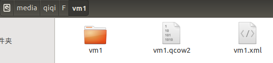

快照文件

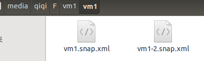

#### 导入虚拟机

*————前提条件：将vm1虚拟机完全删除————*

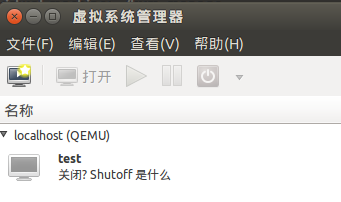

```
[虚拟机管理]：3
		【将通过配置文件进行导入】
【提示：需要用sudo语句执行】
请输入机器名：vm1
请输入配置文件名 [vm1.xml]
请输入配置文件所在目录 [/etc/libvirt/qemu/]/media/qiqi/F/vm1/
-------------------虚拟机配置信息如下------------------------
	虚拟机名          ：vm1
	虚拟机配置文件    ：/media/qiqi/F/vm1//vm1.xml
	虚拟机映像名      ：vm1.qcow2
	虚拟机映像绝对路径：/var/lib/libvirt/images/vm1.qcow2
------------------------------------------------------------
请输入当前映像文件[/media/qiqi/F/vm1//vm1.qcow2]
是否有快照配置文件？【Y/N】y
请输入快照配置文件夹所在目录 [/media/qiqi/F/vm1//vm1]
【映像文件将导入配置目录 [/var/lib/libvirt/images/]
	--执行【cp /media/qiqi/F/vm1//vm1.qcow2 /var/lib/libvirt/images/】
【配置文件vm1.xml将导入默认目录 [/etc/libvirt/qemu/]
	--执行【cp /media/qiqi/F/vm1//vm1.xml /etc/libvirt/qemu/】
【快照配置文件将导入默认目录 [/var/lib/libvirt/qemu/snapshot/vm1]
	--执行【cp -r /media/qiqi/F/vm1//vm1 /var/lib/libvirt/qemu/snapshot/】
虚拟机导入成功！

```

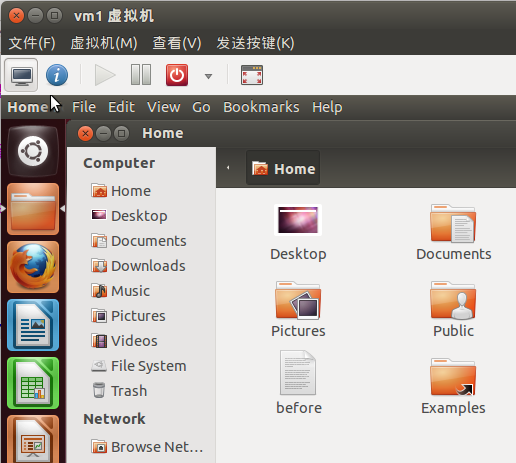

*————检查快照是否倒入成功————*

```
1) 磁盘格式转换raw->qcow2  4) 删除快照
2) 拍摄快照		   5) 查看快照
3) 恢复快照		   6) 返回上一级
[快照]：5
请输入需要查看快照的机器名称：vm1
请输入快照名称【直接Enter查看所有快照】：
 名称               生成时间              状态
------------------------------------------------------------
 vm1-2.snap           2022-07-29 17:57:28 +0800 shutoff
 vm1.snap             2022-07-29 17:57:28 +0800 shutoff

[快照]：3
请输入需要恢复快照的机器名称：vm1
请输入快照名称：vm1-2.snap
快照恢复成功！

```

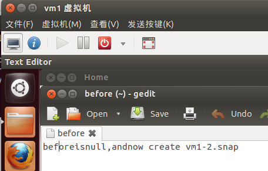

#### 查看KVM硬件信息

```
1) 通过配置文件获取信息	 3) 导入虚拟机		  5) 查看真机硬件信息
2) 导出虚拟机		 4) 查看KVM硬件信息	  6) 返回上一级
[虚拟机管理]：4
【提示：需要用sudo语句执行】
请输入机器名：test
请输入配置文件名 [test.xml]
请输入配置文件所在目录 [/etc/libvirt/qemu/]
-------------------虚拟机配置信息如下------------------------
	虚拟机名          ：test
	虚拟机配置文件    ：/etc/libvirt/qemu//test.xml
	虚拟机映像名      ：test.qcow2
	虚拟机映像绝对路径：/var/lib/libvirt/images/test.qcow2
-------------------------------------------------------------
(standard_in) 1: syntax error
(standard_in) 1: syntax error
CPU个数：
最大内存：k => G
已使用内存：k => G
主硬盘容量：5.0G 5368709120(bytes)
磁盘个数：2
网卡个数：1
-----------------虚拟机磁盘文件信息如下-----------------------
image: /var/lib/libvirt/images/test.qcow2
file format: qcow2
virtual size: 5.0G (5368709120 bytes)
disk size: 2.4G
cluster_size: 65536
Snapshot list:
ID        TAG                 VM SIZE                DATE       VM CLOCK
1         test.snap                 0 2022-07-29 16:57:08   00:00:00.000
Format specific information:
    compat: 1.1
    lazy refcounts: false
-------------------------------------------------------------

```

#### 查看真机硬件信息

```
[虚拟机管理]： 
1) 通过配置文件获取信息	 3) 导入虚拟机		  5) 查看真机硬件信息
2) 导出虚拟机		 4) 查看KVM硬件信息	  6) 返回上一级
[虚拟机管理]：5
物理CPU：2
物理内存：4033536k => 3939m => 3.8GG
磁盘可用容量：k => G

```

## 快照管理

```shell
【KVM管理[主菜单]】：3
1) 磁盘格式转换raw->qcow2   4) 删除快照
2) 拍摄快照		           5) 查看快照
3) 恢复快照		           6) 返回上一级
```

#### 磁盘格式转换raw->qcow2

*————raw格式不能生成快照的情况————*

由于格式raw不能拍摄快照，故将需要拍摄快照的机器，磁盘格式raw转换为qcow2

可以看到，磁盘格式为raw无法拍摄快照

```
【KVM管理[主菜单]】：3
1) 磁盘格式转换raw->qcow2  4) 删除快照
2) 拍摄快照		   5) 查看快照
3) 恢复快照		   6) 返回上一级
[快照]：2
请输入需要拍摄快照的机器名称：test
请输入快照名称：test.snap
快照创建成功！
[快照]：5 
请输入需要查看快照的机器名称：test
请输入快照名称【直接Enter查看所有快照】：
test还未拍摄过快照。
```

> 【此处尚未优化，优化目标为：脚本判断磁盘格式，给出相应选项——
>
> 设想如下：
>
> error：磁盘格式为raw，需转换为qcow2才能拍摄快照
>
> 是否需要转换磁盘格式？【Y/N】

*————磁盘格式转换如下————*

```
请输入需要转换磁盘文件格式的机器名称：test
定义域 test（从 /etc/libvirt/qemu/test.xml）

转换磁盘文件格式成功！
```

*————重新生成快照尝试————*

```
[快照]：2
请输入需要拍摄快照的机器名称：test
请输入快照名称：test.snap
快照创建成功！
[快照]：5
请输入需要查看快照的机器名称：test
请输入快照名称【直接Enter查看所有快照】：
 名称               生成时间              状态
------------------------------------------------------------
 test.snap            2022-07-29 16:57:08 +0800 shutoff
```

#### 拍摄快照

```
【KVM管理[主菜单]】：3
1) 磁盘格式转换raw->qcow2  4) 删除快照
2) 拍摄快照		   5) 查看快照
3) 恢复快照		   6) 返回上一级
[快照]：2
请输入需要拍摄快照的机器名称：vm1
请输入快照名称：vm1-3.snap
快照创建成功！
```


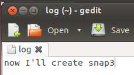

#### 查看快照

```
1) 磁盘格式转换raw->qcow2  4) 删除快照
2) 拍摄快照		   5) 查看快照
3) 恢复快照		   6) 返回上一级
[快照]：5
请输入需要查看快照的机器名称：vm1
请输入快照名称【直接Enter查看所有快照】：
 名称               生成时间              状态
------------------------------------------------------------
 vm1-2.snap           2022-07-28 16:10:37 +0800 shutoff
 vm1-3.snap           2022-07-29 16:22:13 +0800 shutoff
 vm1.snap             2022-07-28 16:10:37 +0800 shutoff

```

#### 恢复快照

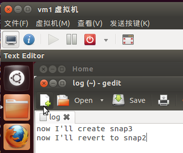

```
1) 磁盘格式转换raw->qcow2  4) 删除快照
2) 拍摄快照		   5) 查看快照
3) 恢复快照		   6) 返回上一级
[快照]：3
请输入需要恢复快照的机器名称：vm1
请输入快照名称：vm1-3.snap
快照恢复成功！

```

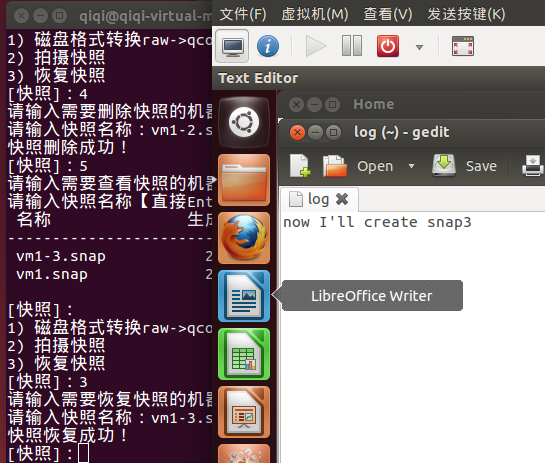

#### 删除快照

```
[快照]：
1) 磁盘格式转换raw->qcow2  4) 删除快照
2) 拍摄快照		   5) 查看快照
3) 恢复快照		   6) 返回上一级
[快照]：4
请输入需要删除快照的机器名称：vm1
请输入快照名称：vm1-2.snap
快照删除成功！
[快照]：5
请输入需要查看快照的机器名称：vm1
请输入快照名称【直接Enter查看所有快照】：
 名称               生成时间              状态
------------------------------------------------------------
 vm1-3.snap           2022-07-29 16:22:13 +0800 shutoff
 vm1.snap             2022-07-28 16:10:37 +0800 shutoff

```


---

## 代码【以下函数全部在functions.sh中】

其余shell脚本只负责调用

### 虚拟机管理[由vm_manage.sh调用

【通过配置文件获取信息】

```shell
#通过配置文件获取信息
getConfig(){
	echo "【提示：需要用sudo语句执行】"
	check_user=`whoami`
	if [ "$check_user" != "root" ];then
		echo "you are not sudo user，return"
		return
	fi
	read -p "请输入机器名：" name
	read -p "请输入配置文件名 [${name}.xml]" xmlName
	if [ -z "$xmlName" ];then
		xmlName="${name}.xml"
	fi
	read -p "请输入配置文件所在目录 [/etc/libvirt/qemu/]" xmlPath
	if [ -z "$xmlPath" ];then
		xmlPath="/etc/libvirt/qemu/"
	fi

	#配置文件【含绝对路径
	xml=${xmlPath}/${xmlName}  
	#虚拟机名
	name=`xmllint --xpath "//domain[@type='kvm']/name/text()" ${xml}`
	#虚拟机映像绝对路径
	imgPath=`xmllint --xpath "//domain[@type='kvm']/devices/disk[@type='file'][@device='disk']/source/@file" ${xml}`  # file="/var/lib/libvirt/images/vm1.qcow2"
	imgPath=${imgPath#*\"} #/var/lib/libvirt/images/vm1.qcow2"
	imgPath=${imgPath%*\"} #/var/lib/libvirt/images/vm1.qcow2
	#虚拟机映像名
	imgName=${imgPath##*/}
	echo "-------------------虚拟机配置信息如下------------------------"
	echo "	虚拟机名          ：${name}"  #vm1
	echo "	虚拟机配置文件    ：${xml}"
	echo "	虚拟机映像名      ：${imgName}"  #vm1.qcow2
	echo "	虚拟机映像绝对路径：${imgPath}"  #/var/lib/libvirt/images/vm1.qcow2
	echo "-------------------------------------------------------------"
}
```

【导出虚拟机】

```shell
#导出虚拟机
exportKvm(){
	showKvm &> /dev/null
	if [ ${#list1[*]} -eq 0 ];then
		echo "当前没有任何KVM可以导出。"
	else
		echo "		【将通过配置文件进行导出】"
		getConfig
		read -p "请输入虚拟机将导入的路径 [/home/${name}/]：" outPath
		if [ -z "$outPath" ];then
			outPath="/home/${name}/"  #
		fi
		#考虑有快照时也要导出
		hasSnap=0
		snapshotList=($(virsh snapshot-list ${name}|awk 'NR>=3{count[$1]++}END{for(i in count){print i}}'))
		if [ ${#snapshotList[*]} -ne 0 ];then
			read -p "请输入快照配置文件路径 [/var/lib/libvirt/qemu/snapshot/${name}]" snapXmlPath
			if [ -z "$snapXmlPath" ];then
				snapXmlPath="/var/lib/libvirt/qemu/snapshot/${name}"
			fi
		fi
		for i in ${list1[*]};do 
			if [ "${i}" == "${name}" ];then
				flag=0   
				mark=0
				for j in ${list2[*]};do        #检查该机器是否处于运行状态，不建议对处于运行状态的机器导出
					[ "${j}" == "${name}" ] && echo "${name} 正在运行，请您先停止机器再导出！" && flag=1 && break
				done
				if [ ${flag} -eq 0 ];then               
					flag=1 
					mkdir ${outPath}/
					echo "映像文件导出，执行【cp ${imgPath} ${outPath}】" ;cp ${imgPath} ${outPath} #映像文件导出
					echo "配置文件导出，执行【cp ${xml} ${outPath}】" ;cp ${xml} ${outPath} #配置文件导出
					if [ ${#snapshotList[*]} -ne 0 ];then
						echo "快照配置导出，执行【cp -r ${snapXmlPath} ${outPath}】" ;cp -r ${snapXmlPath} ${outPath} #快照配置文件导出
					fi
					echo "虚拟机导出成功！"
				fi
			fi
		done
		
	fi
	[ "${mark}" != "0" ] && echo "$name 不存在！"
	mark=1
}
```

【导入虚拟机】

```shell
#导入虚拟机
importKvm(){
	showKvm &> /dev/null
	echo "		【将通过配置文件进行导入】"
	getConfig
	imgPath=${imgPath%/*}"/" #/var/lib/libvirt/images/   #删除本来是含有映像文件自身名字的
	if [ "$check_user" == "root" ];then  #判断是否时sudo用户
		:
	else
		return
	fi
	if [ ${#list1[*]} -ne 0 ];then
		for i in ${list1[*]};do 
			if [ "${i}" == "${name}" ];then
				echo "已存在该虚拟机，无法导入"
				return
			fi
		done
		
	fi
	read -p "请输入当前映像文件[${xmlPath}/${imgName}]" imgNow
	if [ -z "$imgNow" ];then
		imgNow="${xmlPath}/${imgName}"
	fi
	read -p "是否有快照配置文件？【Y/N】" answer1  
	case ${answer1} in
	Y|y)
		read -p "请输入快照配置文件夹所在目录 [${xmlPath}/${name}]" snapXmlPath
		if [ -z "$snapXmlPath" ];then
			snapXmlPath="${xmlPath}/${name}"
		fi
		;;
	N|n)
		echo "已取消删除操作"
		;;
	*)
		echo "输入有误，请输入<Y/y|N/n>"
	esac
	


	echo "【映像文件将导入配置目录 [${imgPath}]"
	echo "	--执行【cp ${imgNow} ${imgPath}】" ;cp ${imgNow} ${imgPath} #映像文件导入

	echo "【配置文件${xmlName}将导入默认目录 [/etc/libvirt/qemu/]"
	echo "	--执行【cp ${xml} /etc/libvirt/qemu/】" ;cp ${xml} /etc/libvirt/qemu/ #配置文件导入
	virsh define /etc/libvirt/qemu/${xmlName} &> /dev/null

	case ${answer1} in
	Y|y)
		echo "【快照配置文件将导入默认目录 [/var/lib/libvirt/qemu/snapshot/${name}]"
		echo "	--执行【cp -r ${snapXmlPath} /var/lib/libvirt/qemu/snapshot/】" ;cp -r ${snapXmlPath} /var/lib/libvirt/qemu/snapshot/ #快照配置文件导入
		for file in  ` ls /var/lib/libvirt/qemu/snapshot/${name}/`
		do
			#echo "virsh snapshot-create vm1 /var/lib/libvirt/qemu/snapshot/${name}/$file"
			virsh snapshot-create vm1 /var/lib/libvirt/qemu/snapshot/${name}/$file &> /dev/null
		done
		
		;;
	N|n)
		echo ""
		;;
	*)
		：
	esac

	echo "虚拟机导入成功！"
}
```


### 快照管理[由snapshot.sh调用

【磁盘格式转换raw->qcow2】

```shell
#磁盘格式转换raw->qcow2
convertQcow2(){
	showKvm &> /dev/null
	if [ ${#list1[*]} -eq 0 ];then
		echo "当前没有任何KVM可以转换磁盘文件格式。"
	else
		read -p  "请输入需要转换磁盘文件格式的机器名称：" name
		for i in ${list1[*]};do 
			if [ "${i}" == "${name}" ];then
				flag=0   
				mark=0
				for j in ${list2[*]};do        #检查该机器是否处于运行状态，不建议对处于运行状态的机器转换磁盘文件格式
					[ "${j}" == "${name}" ] && echo "${name} 正在运行，请您先停止机器再转换磁盘文件格式！" && flag=1 && break
				done
				if [ ${flag} -eq 0 ];then               
					flag=1 
					qemu-img convert -f raw -O qcow2 /var/lib/libvirt/images/${name}.img /var/lib/libvirt/images/${name}.qcow2
					sed -i "s/'raw'/'qcow2'/g" /etc/libvirt/qemu/${name}.xml
					sed -i 's/.img/.qcow2/g' /etc/libvirt/qemu/${name}.xml
					virsh define /etc/libvirt/qemu/${name}.xml
					echo "转换磁盘文件格式成功！"
				fi
			fi
		done
	fi
	[ "${mark}" != "0" ] && echo "$name 不存在！"
	mark=1
}
```

【拍摄快照】

```shell
#拍摄快照
makeSnapshot(){
	showKvm &> /dev/null
	showKvmAlived &> /dev/null
	if [ ${#list1[*]} -eq 0 ];then
		echo "当前没有任何KVM可以拍摄快照。"
	else
		read -p  "请输入需要拍摄快照的机器名称：" name
		read -p  "请输入快照名称："  snapshotName
		for i in ${list1[*]};do 
			if [ "${i}" == "${name}" ];then
				flag=0   
				mark=0
				for j in ${list2[*]};do        #检查该机器是否处于运行状态，不建议对处于运行状态的机器拍摄快照s
					[ "${j}" == "${name}" ] && echo "${name} 正在运行，请您先停止机器再拍摄快照！" && flag=1 && break
				done
				snapshotList=($(virsh snapshot-list ${name}|awk 'NR>=3{count[$1]++}END{for(i in count){print i}}'))  #提取出该机器所有的快照的名称
				for x in ${snapshotList[*]};do
					[[ "${x}" == "${snapshotName}" ]] && echo "该快照已经存在！" && flag=2 && break  #同一机器的快照名称不能重复
				done
				if [ ${flag} -eq 0 ];then               
					flag=1                             
					virsh snapshot-create-as ${name} ${snapshotName}  &> /dev/null                       #拍摄快照
					echo "快照创建成功！"
				fi
			fi
		done
	fi
	[ "${mark}" != "0" ] && echo "$name 不存在！"
	mark=1
}
```

【恢复快照】

```shell
#恢复快照
recoverSnapshot(){
	showKvm &> /dev/null
	showKvmAlived &> /dev/null
	if [ ${#list1[*]} -eq 0 ];then
		echo "当前没有任何KVM可以进行快照恢复。"
	else
		read -p  "请输入需要恢复快照的机器名称：" name
		read -p  "请输入快照名称："  snapshotName
		for i in ${list1[*]};do 
			if [ "${i}" == "${name}" ];then
				flag=0   
				mark=0
				symbol=0
				for j in ${list2[*]};do
					[ "${j}" == "${name}" ] && echo "${name} 正在运行，请您先停止机器再恢复快照！" && flag=1 && break  #先关机再进行恢复
				done
				snapshotList=($(virsh snapshot-list ${name}|awk 'NR>=3{count[$1]++}END{for(i in count){print i}}'))  #将快照名称提取出来
				for x in ${snapshotList[*]};do
					[[ "${x}" == "${snapshotName}" ]] && symbol=1 && break
				done
				[[ ${symbol} -eq 0 ]] && echo "${snapshotName}不存在！"         #要判断输入的快照是否存在
				if [[ ${flag} -eq 0 && ${symbol} -eq 1 ]];then               
					flag=1
					symbol=0
					virsh snapshot-revert ${name} ${snapshotName}  &> /dev/null
					echo "快照恢复成功！"
				fi
			fi
		done
	fi
	[ "${mark}" != "0" ] && echo "${name} 不存在！"
	mark=1
}
```

【删除快照】

```shell
#删除快照
deleteSnapshot(){
	showKvm &> /dev/null
	showKvmAlived &> /dev/null
	if [ ${#list1[*]} -eq 0 ];then
		echo "当前没有任何KVM可以进行快照删除。"
	else
		read -p  "请输入需要删除快照的机器名称：" name
		read -p  "请输入快照名称："  snapshotName
		for i in ${list1[*]};do 
			if [ "${i}" == "${name}" ];then
				flag=0   
				mark=0
				symbol=0
				for j in ${list2[*]};do
					[ "${j}" == "${name}" ] && echo "${name} 正在运行，请您先停止机器再删除快照！" && flag=1 && break
				done
				snapshotList=($(virsh snapshot-list ${name}|awk 'NR>=3{count[$1]++}END{for(i in count){print i}}'))  #将指定的机器的快照名称取出来做成列表
				for x in ${snapshotList[*]};do
					[[ "${x}" == "${snapshotName}" ]] && symbol=1 && break
				done
				[[ ${symbol} -eq 0 ]] && echo "${snapshotName}不存在！"
				[[ ${#snapshotList[*]} -eq 0 ]] && echo "${name}没有快照可删除！"
				if [[ ${flag} -eq 0 && ${symbol} -eq 1 ]];then 
					flag=1
					symbol=0
					virsh snapshot-delete ${name} ${snapshotName}  &> /dev/null
					echo "快照删除成功！"
				fi
			fi
		done
	fi
	[ "${mark}" != "0" ] && echo "${name} 不存在！"
	mark=1
}
```

【查看快照】

```shell
#查看快照
findSnapshot(){
	showKvm &> /dev/null
	showKvmAlived &> /dev/null
	if [ ${#list1[*]} -eq 0 ];then
		echo "当前没有KVM可查看。"
	else
		read -p  "请输入需要查看快照的机器名称：" name
		read -p  "请输入快照名称【直接Enter查看所有快照】："  snapshotName
		for i in ${list1[*]};do 
			if [ "${i}" == "${name}" ];then
				mark=0
				symbol=0
				snapshotList=($(virsh snapshot-list ${name}|awk 'NR>=3{count[$1]++}END{for(i in count){print i}}'))
				[[ ${#snapshotList[*]} -eq 0 ]] && echo "${name}还未拍摄过快照。" && break
				if [[ "${snapshotName}" == "" ]];then
					virsh snapshot-list ${name}
				else
					for x in ${snapshotList[*]};do
						[[ "${x}" == "${snapshotName}" ]] && symbol=1 && break
					done
					[[ ${symbol} -eq 0 ]] && echo "${snapshotName}不存在！"
					[[ ${symbol} -eq 1 ]] && virsh snapshot-info ${name} ${snapshotName}
				fi
			fi
		done
	fi
	[ "${mark}" != "0" ] && echo "${name} 不存在！"
	mark=1
}
```

### 基础管理base_manage

```shell
#查看所有kvm
showKvm(){ 
	list1=(`virsh list --all|awk 'NR>=3{print $2}'`)  #将所有kvm的名称做成一个列表，方便后面调用
	[ ${#list1[*]} -ne 0 ] && virsh list --all  || echo "当前没有任何KVM可以管理。"   #列表为空时说明没有还没有kvm
}
#查看所有正在运行的kvm
showKvmAlived(){
    list2=(`virsh list|awk 'NR>=3{print $2}'`)        #将所有的正在运行的kvm做成列表，方便后面调用
    result=${#list2[*]}
    if [ ${result} -eq 0 ];then
        echo "当前没有KVM在运行。"
    else
        virsh list
    fi
}
#关闭kvm
shutdownKvm(){
    showKvmAlived &> /dev/null                         #先调用showKvmAlived函数，可以获得函数内的列表等，用于后续判断
    if [ ${result} -eq 0 ];then						   #showKvmAlived函数的result，如果为0，直接退出，不进行任何判断
        echo "当前没有KVM在运行。"
    else
        echo "当前正在运行的KVM：${list2[*]}"
        read -p "请输入您要关闭的KVM：" name
		flag=0      #定义一个标志，如果最后这个标志没有改变，则说明输入的kvm不在运行列表中
        for i in `seq 0 ${#list2[*]}`;do            #遍历对比，看看用户输入的名称是否存在
            listName=${list2[$i]}
            [[ "${name}" == "${listName}" ]] && virsh shutdown ${name} && flag=1 && break    #若成功关机，则改变flag的值
        done
		[ ${flag} -eq 0 ] && echo "关机失败！此KVM没有在运行。"      #通过flag判断告知结果
        
    fi
}
#启动kvm
startKvm(){
	showKvm > /dev/null                                      #以下类似的调用的作用都是一样的
	if [ ${#list1[*]} -eq 0 ];then
	    echo "当前没有任何KVM可以启动。"
	else
		echo "当前拥有的KVM：${list1[*]}"
		read -p "请输入您要开启的KVM：" name
		flag=0
        for i in `seq 0 ${#list1[*]}`;do
            listName=${list1[$i]}
            [[ "${name}" == "${listName}" ]] && virsh start ${name} && flag=1 && break
        done
        [ ${flag} -eq 0 ] && echo "开机失败！此KVM不存在或正在运行。"                 #正在运行或不存在的kvm无法执行开机操作
    fi
}
#重启kvm
rebootKvm(){
	showKvmAlived &> /dev/null
        if [ ${result} -eq 0 ];then
            echo "当前没有KVM在运行。"
        else
            echo "当前正在运行的KVM：${list2[*]}"
            read -p "请输入您要重启的KVM：" name
			flag=0
            for i in `seq 0 ${#list2[*]}`;do
                listName=${list2[$i]}
                [[ "${name}" == "${listName}" ]] && virsh reboot ${name} && flag=1 && break
            done
            [ ${flag} -eq 0 ] && echo "重启失败！此KVM没有在运行。" #这里实际上缺少一个对于输入的名称是否存在与kvm名单的判断，不过不影响功能实现
        fi
}
#强制关闭kvm
destroyKvm(){
	showKvmAlived &> /dev/null
        if [ ${result} -eq 0 ];then
            echo "当前没有KVM在运行。"
        else
            echo "当前正在运行的KVM：${list2[*]}"
            read -p "请输入您要强制关闭的KVM：" name
			flag=0
            for i in `seq 0 ${#list2[*]}`;do
                listName=${list2[$i]}
                [[ "${name}" == "${listName}" ]] && virsh destroy ${name} && flag=1 && break
            done
            [ $flag -eq 0 ] && echo "强制关机失败！此KVM没有在运行。"   #强制重启动作只能作用与已经处于运行状态的kvm
        fi
}
#删除kvm
deleteKvm(){
	read -p "请输入您要删除的KVM：" name
	read -p "此操作不可逆，您确定要进行删除吗？【Y/N】" answer1    #确认删除
	case ${answer1} in
	Y|y)
		showKvmAlived &> /dev/null
		showKvm &> /dev/null
		for i in ${list1[*]};do                 #检查输入的名称是否属于已存在的kvm
			if [ "${i}" == "${name}" ];then
				flag=0                            #flag标志和mark标志都是为了方便后面的判断
				mark=0
				for j in ${list2[*]};do               #若输入的名称属于已存在的kvm，则继续检查此kvm是否处于运行状态
					[ "${j}" == "${name}" ] && echo "${name} 正在运行，无法直接删除，请先停止机器。" && flag=1 && break
				done
				#检查该机器是否为链接克隆的原机器
				[ -e ./cloneRelationship ] && checkClone=($(awk -F"[ |.]" '/^A/{print $5}' ./cloneRelationship))
				for x in ${checkClone[*]};do
					#判断要删除的机器是否为链接克隆的源机器，是源机器则不能删除
					[[ "${x}" == "${name}" ]] && echo "注意： ${name} 是链接克隆的源机器，删除后其克隆机将不可用。若您确实希望删除此机器，请您先处理其链接克隆的机器。" && flag=2 && break
				done
				if [ ${flag} -eq 0 ];then                #flag的值若没有被改变，则说明满足删除KVM的条件
					flag=1                              #判断完之后要马上将flag的值变成非0值，否则一旦执行了一次成功的删除，flag的值就会一直是0，影响后面判断
					diskName=(`virsh domblklist $name|awk 'NR>=3{print $2}'`)      #先获取kvm的磁盘文件再执行删除动作，否则先删除的话就无法使用domblklist命令获取
					#echo "virsh undefine ${name}"
					#需要delete snapshot
					snapshotList=($(virsh snapshot-list ${name}|awk 'NR>=3{count[$1]++}END{for(i in count){print i}}'))
					for snapshot in ${snapshotList[*]};do
						virsh snapshot-delete ${name} ${snapshot}  &> /dev/null
					done
					virsh undefine ${name}  &> /dev/null
					[ -e ./cloneRelationship ] && sed -ri "/${name} /d" cloneRelationship  #要先判断一下这个文件是否存在，若不存在则说明当前还没有克隆关系
					rm -rf /var/lib/libvirt/qemu/snapshot/${name}/    &> /dev/null                #删除该机器相关的快照文件
					read -p "已为您删除$name，您要删除$name的磁盘文件吗？【Y/N】" answer2    #undefine不会删除相应的磁盘文件，需要下一步操作
					case ${answer2} in
					Y|y)
						for n in ${diskName[*]};do                   #一台kvm的可能有多个磁盘，也就是多个磁盘文件，这里是直接把对应的磁盘文件全都删除了
							rm -rf ${n}
						done
						echo "已为您删除磁盘文件。"
						;;
					N|n)
						echo "磁盘文件已保留，您可以通过磁盘文件恢复此KVM的数据"
						;;
					*)
						echo "输入有误，请手动删除${name}的磁盘文件，否则磁盘文件将保留。"
					esac
				fi
			fi
		done
		[ "${mark}" != "0" ] && echo "$name 不存在！"
		mark=1			#mark如果没有被改变，则说明不存在该名称的kvm,用完之后要将mark改成非0，否则成功删除一次之后，他就一直是0了，影响后面的判断
		;;
	N|n)
		echo "已取消删除操作"
		;;
	*)
		echo "输入有误，请输入<Y/y|N/n>"
	esac
}
```

